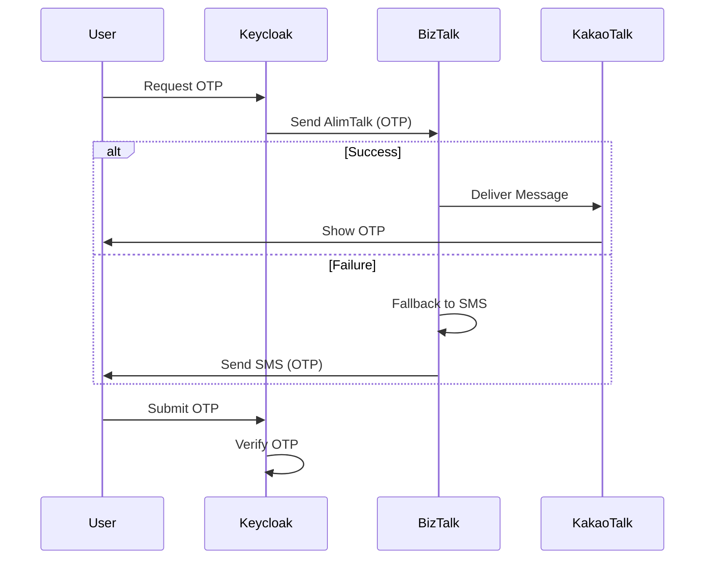
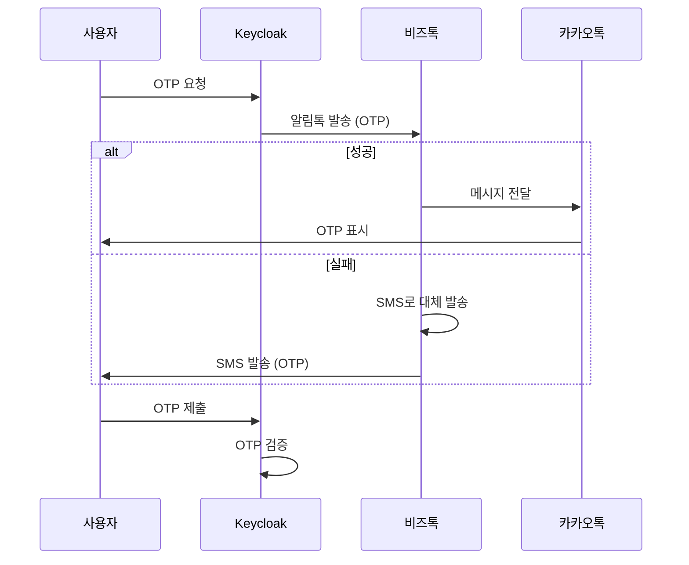

# Keycloak Kakao OTP SPI

[English](#english) | [한국어](#korean)

---

<a name="english"></a>
## English

### Overview
This project provides a Keycloak SPI for Kakao OTP authentication using BizTalk (AlimTalk). It allows sending OTP codes via KakaoTalk with an SMS fallback mechanism. It also supports sending "Signup Complete" notifications.

### Features
- **Kakao OTP**: Sends OTP via KakaoTalk (BizTalk).
- **SMS Fallback**: Automatically falls back to SMS if KakaoTalk delivery fails.
- **Signup Notification**: Sends a notification upon successful user registration.
- **Extensible Sender**: Uses `MessageSenderProvider` SPI, allowing custom sender implementations.

### Flow Diagram


### Build & Publish
To build the JAR:
```bash
./gradlew shadowJar
```
The output JAR will be located in `build/libs/keycloak-kakao-otp-provider-1.0.0.jar`.

To publish to your local Maven repository (required for building dependent projects like `keycloak-self-service-provider`):
```bash
./gradlew publishToMavenLocal
```

### Installation
1. Copy the JAR file to the `providers` directory of your Keycloak installation.
2. Restart Keycloak or run `kc.sh build`.

### Docker Support
You can build a custom Keycloak image with this provider included:

```bash
docker build -t my-keycloak .
docker run -p 8080:8080 my-keycloak start-dev
```

### Configuration
**1. SPI Configuration (Environment Variables)**
The BizTalk connection details and "Signup Done" template are now configured via environment variables.

| Environment Variable | Description | Example |
|----------------------|-------------|---------|
| `KC_SPI_MESSAGE_SENDER_BIZTALK_BASE_URL` | BizTalk API Base URL | `https://kecp-biztalk.kdn.com:14343` |
| `KC_SPI_MESSAGE_SENDER_BIZTALK_SYSTEM_KEY` | System Key | `key` |
| `KC_SPI_MESSAGE_SENDER_BIZTALK_PROJECT_ID` | Project ID | `yourproject` |
| `KC_SPI_MESSAGE_SENDER_BIZTALK_CALL_BACK_NO` | Callback Phone Number | `01000000000` |
| `KC_SPI_MESSAGE_SENDER_BIZTALK_TMPL_DONE` | Signup Done Template Code | `TMPL_001` |
| `KC_SPI_MESSAGE_SENDER_BIZTALK_TITLE_DONE` | Signup Done Title | `Welcome` |
| `KC_SPI_MESSAGE_SENDER_BIZTALK_CONTENT_DONE` | Signup Done Content | `Welcome ${name}. Phone: ${phone}` |

**2. Authentication Flow (UI)**
- Go to **Authentication** -> **Flows**.
- Select the flow containing **Kakao Phone OTP**.
- Click the **Gear Icon** (Config) for "Kakao Phone OTP".
- **OTP Template**: You can override the OTP template code here. If left empty, it expects `tmplOtp` in the global config (if supported) or you can add `KC_SPI_MESSAGE_SENDER_BIZTALK_TMPL_OTP` etc. to env vars if you wish to support global OTP defaults (currently code supports overrides).
    - **Base URL**: e.g., `https://kecp-biztalk.kdn.com:14343`
    - **systemKey**, **projectId**, **callBackNo**
    - **Templates**: Configure template codes and content for OTP and Done notifications.

---

<a name="korean"></a>
## Korean (한국어)

### 개요
이 프로젝트는 비즈톡(알림톡)을 이용한 카카오 OTP 인증 기능을 제공하는 Keycloak SPI입니다. 카카오톡으로 OTP 인증번호를 발송하며, 실패 시 자동으로 SMS로 재발송하는 기능을 포함합니다. 또한 회원가입 완료 시 알림톡을 전송하는 기능도 지원합니다.

### 주요 기능
- **카카오 OTP**: 비즈톡을 통해 카카오톡으로 OTP 발송.
- **SMS 대체 발송**: 카카오톡 발송 실패 시 SMS로 자동 대체 발송.
- **가입 완료 알림**: 사용자 회원가입 완료 시 알림톡 전송.
- **확장 가능한 발송기**: `MessageSenderProvider` SPI를 사용하여 발송 구현체를 교체하거나 확장 가능.

### 흐름도 (Flow Diagram)


### 빌드 및 배포 (Build & Publish)
JAR 파일 빌드:
```bash
./gradlew shadowJar
```
빌드된 JAR 파일은 `build/libs/keycloak-kakao-otp-provider-1.0.0.jar` 경로에 생성됩니다.

로컬 Maven 저장소에 배포 (의존성 프로젝트 빌드 시 필요):
```bash
./gradlew publishToMavenLocal
```

### 설치 방법
1. 생성된 JAR 파일을 Keycloak 설치 경로의 `providers` 디렉토리에 복사합니다.
2. Keycloak을 재시작하거나 `kc.sh build` 명령을 실행합니다.

### 설정 방법
1. Keycloak 관리자 콘솔에서 **Authentication** > **Flows**로 이동합니다.
2. 등록(Registration) 또는 로그인(Login) 플로우에 "Kakao Phone OTP (BizTalk)" 실행(Execution)을 추가합니다.
3. 해당 실행의 "Actions" (톱니바퀴 아이콘) > **Config**를 클릭합니다.
4. 비즈톡 연동 정보를 입력합니다:
    - **Base URL**: 예: `https://kecp-biztalk.kdn.com:14343`
    - **systemKey**, **projectId**, **callBackNo**
    - **Templates**: OTP 및 가입 완료 알림을 위한 템플릿 코드와 내용을 설정합니다.

## License
MIT
